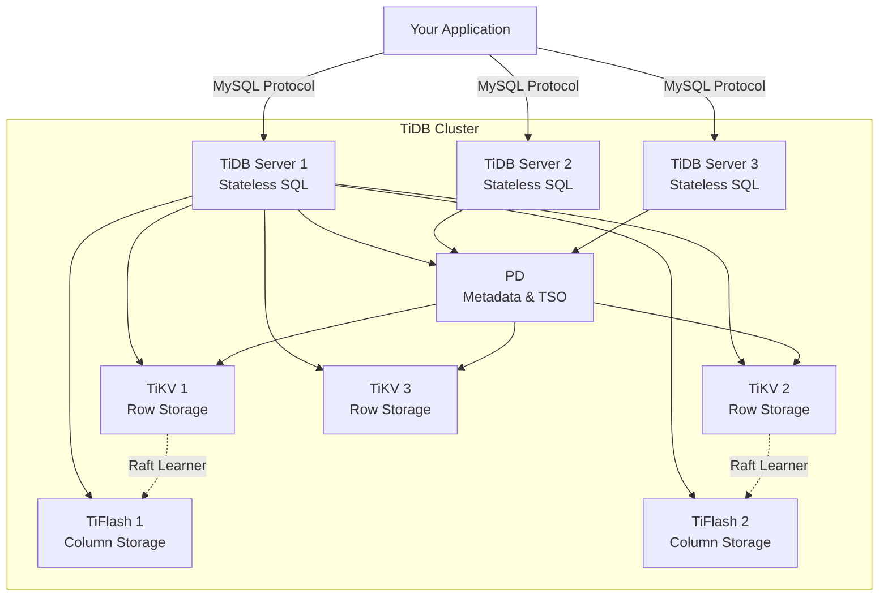
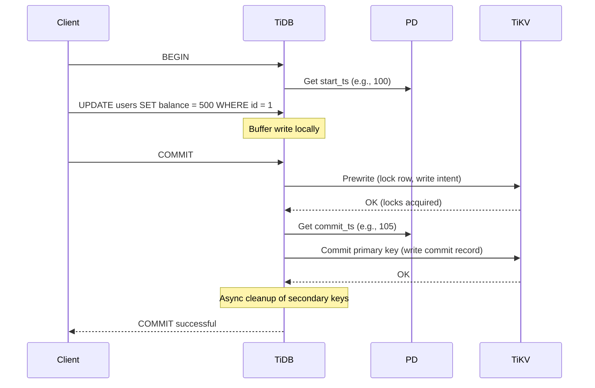

# Understanding TiDB: Architecture and Core Concepts

**Blog Series**: TiDB Deep Dive (Part 1 of 7)
**Analysis Commit**: [`bd6aa865`](https://github.com/pingcap/tidb/tree/bd6aa865308ed409fd7010af83a84249bf398d8c)
**Read Time**: 15 minutes

---

## What You'll Learn

By the end of this post, you'll understand:
- What TiDB is and why it exists
- The fundamental architecture separating compute from storage
- How TiDB, TiKV, PD, and TiFlash work together
- The key trade-offs that make TiDB unique
- When to choose TiDB over alternatives

---

## The Problem TiDB Solves

Imagine you're running a fast-growing SaaS application. Your MySQL database works great—until it doesn't. You've hit the scaling wall:

- **Vertical scaling** is expensive and has limits
- **Horizontal scaling** MySQL is painful (sharding, proxy layers, eventual consistency)
- **NoSQL** databases lose SQL expressiveness and transactions

What if you could have:
- ✅ MySQL compatibility (existing apps work)
- ✅ Horizontal scalability (add nodes, not reshard)
- ✅ Strong ACID guarantees (no eventual consistency surprises)
- ✅ Both transactional and analytical workloads (HTAP)

**This is TiDB's value proposition.**

---

## The Big Picture: Disaggregated Architecture

TiDB's secret is **separation of concerns**. Unlike monolithic databases (MySQL, PostgreSQL), TiDB splits into distinct layers:



### The Four Components

#### 1. **TiDB (SQL Layer)** - The Codebase We're Analyzing

**This repository** contains the SQL layer: stateless servers that:
- Accept MySQL protocol connections
- Parse SQL into Abstract Syntax Trees (AST)
- Optimize queries into execution plans
- Coordinate distributed execution
- Return results to clients

**Key Insight**: TiDB servers hold **no data**. They're pure compute. You can add or remove them instantly without data migration.

**Code Entry Point**: [`cmd/tidb-server/main.go:280`](https://github.com/pingcap/tidb/blob/bd6aa865/cmd/tidb-server/main.go#L280)

```go
// Simplified startup sequence
func main() {
    // 1. Load configuration
    cfg := config.GetGlobalConfig()

    // 2. Register storage drivers (TiKV, MockTiKV, UniStore)
    registerStores()

    // 3. Initialize metrics, logging, tracing
    metrics.InitMetrics()
    logutil.InitLogger(cfg.Log.ToLogConfig())

    // 4. Create storage and domain
    storage, dom := createStoreDDLOwnerMgrAndDomain()

    // 5. Start MySQL protocol server
    svr := createServer(storage, dom)
    svr.Run()
}
```

**What This Code Reveals**:
- TiDB connects to storage (`createStoreDDLOwnerMgrAndDomain()`)
- It doesn't create storage—storage is external (TiKV)
- The `domain` manages global metadata (we'll explore this later)

---

#### 2. **TiKV (Storage Layer)** - Distributed Key-Value Store

TiKV (separate repository: `tikv/tikv`) is where data actually lives:
- Built on RocksDB (LSM-tree storage engine)
- Raft consensus for replication (3 copies by default)
- Multi-version concurrency control (MVCC)
- Coprocessor for push-down computation

**Data Organization**:
- Data split into **Regions** (~96MB each)
- Each Region has 3 replicas across different TiKV nodes
- Raft ensures consistency (leader + 2 followers)

**Example**:
```
Table: users (id, name, email)
Row: (1001, "Alice", "alice@example.com")

Stored in TiKV as:
Key:   t_10_r_1001
Value: ["Alice", "alice@example.com"]

Region: [t_10_r_1000, t_10_r_2000)
  ├── TiKV-1 (Leader)
  ├── TiKV-2 (Follower)
  └── TiKV-3 (Follower)
```

**From TiDB's Perspective**:
TiDB uses the `tikv/client-go` library to communicate with TiKV.

**Code**: [`pkg/store/driver/tikv_driver.go`](https://github.com/pingcap/tidb/blob/bd6aa865/pkg/store/driver/tikv_driver.go)

---

#### 3. **PD (Placement Driver)** - The Brain

PD (separate repository: `tikv/pd`) manages cluster metadata and coordination:

**Three Critical Roles**:

1. **Timestamp Oracle (TSO)**
   - Issues globally unique, monotonically increasing timestamps
   - Used for MVCC and distributed transaction commit

2. **Region Routing**
   - Tracks which TiKV node owns which key ranges
   - TiDB queries PD to locate data

3. **Load Balancing**
   - Monitors TiKV health and load
   - Automatically rebalances regions across TiKV nodes

**Code**: TiDB accesses PD via [`tikv/pd/client`](https://github.com/tikv/pd/tree/master/client)

---

#### 4. **TiFlash (Analytical Engine)** - Optional Columnar Store

TiFlash (separate repository: `pingcap/tiflash`) provides HTAP capabilities:
- Columnar storage (optimized for scans and aggregations)
- Real-time replication from TiKV via Raft Learner
- MPP (Massively Parallel Processing) execution

**When TiDB Uses TiFlash**:
- Analytical queries (large scans, aggregations)
- Queries with `/*+ READ_FROM_STORAGE(TIFLASH[table]) */` hint
- Automatic selection based on cost optimizer

**Code**: [`pkg/distsql/distsql.go`](https://github.com/pingcap/tidb/blob/bd6aa865/pkg/distsql/distsql.go) coordinates both TiKV and TiFlash

---

## Core Design Decisions and Trade-Offs

### 1. **Compute-Storage Separation**

**Decision**: TiDB (compute) is separate from TiKV (storage)

**Benefits**:
- ✅ Scale compute and storage independently
- ✅ TiDB servers are stateless → easy to add/remove
- ✅ Storage handles replication → TiDB doesn't worry about it

**Trade-Offs**:
- ❌ Network hop for every query (vs. local disk in monolithic DB)
- ❌ More complex deployment (vs. single binary)

**Mitigation**: Coprocessor push-down reduces network transfers

**Industry Comparison**:
- **Similar**: Snowflake, Google BigQuery (compute-storage separation)
- **Different**: MySQL, PostgreSQL (monolithic)
- **Hybrid**: Aurora (separation but tighter coupling)

**Why This Choice?** Cloud-native scalability was prioritized over single-machine performance.

---

### 2. **Percolator-Based Distributed Transactions**

**Decision**: Use Google's Percolator algorithm for 2PC (Two-Phase Commit)

**How It Works**:


**Benefits**:
- ✅ Strong consistency (ACID with serializability)
- ✅ No single point of failure
- ✅ Works across thousands of nodes

**Trade-Offs**:
- ❌ Higher latency than single-node transactions (2 RTTs to PD, 2 RTTs to TiKV)
- ❌ Write conflicts require retry

**Modes**:
- **Optimistic**: Default, good for low contention
- **Pessimistic**: Lock on first write, good for high contention

**Code**: [`pkg/sessiontxn/`](https://github.com/pingcap/tidb/tree/bd6aa865/pkg/sessiontxn) manages transaction lifecycle

**Citations**:
- Percolator Paper (Google, 2010): https://research.google/pubs/pub36726/
- Spanner Paper (Google, 2012): https://research.google/pubs/pub39966/

---

### 3. **MySQL Protocol Compatibility**

**Decision**: Implement MySQL 8.0 wire protocol and SQL dialect

**Benefits**:
- ✅ Existing applications work with minimal changes
- ✅ Reuse MySQL drivers, ORMs, tools
- ✅ Familiar mental model for developers

**Trade-Offs**:
- ❌ Constrained by MySQL semantics (even quirks)
- ❌ Some features hard to implement distributed (e.g., `SELECT ... FOR UPDATE`)

**Compatibility Level**: ~95% for common SQL, ~80% for advanced features

**Code**: [`pkg/server/conn.go:1000+`](https://github.com/pingcap/tidb/blob/bd6aa865/pkg/server/conn.go#L1000) implements protocol

**Example**: Handling a query
```go
func (cc *clientConn) handleQuery(ctx context.Context, sql string) error {
    // Parse SQL
    stmts, err := cc.ctx.Parse(ctx, sql)

    // Execute each statement
    for _, stmt := range stmts {
        rs, err := cc.ctx.ExecuteStmt(ctx, stmt)
        if err != nil {
            return err
        }
        // Send results to client in MySQL format
        err = cc.writeResultset(ctx, rs)
    }
    return nil
}
```

---

### 4. **Push-Down Computation**

**Decision**: Send filters, aggregations, and projections to TiKV/TiFlash instead of pulling all data to TiDB

**Example**:
```sql
SELECT region, COUNT(*)
FROM orders
WHERE created_at > '2024-01-01'
GROUP BY region
```

**Without Push-Down** (naive approach):
```
TiKV → TiDB: 10M rows (all orders)
TiDB: Filter, aggregate, return 5 rows
Network: 10M rows transferred
```

**With Push-Down** (TiDB's approach):
```
TiDB → TiKV: "Filter created_at, aggregate by region"
TiKV: Process locally, return 5 rows
TiDB: Merge results, return to client
Network: 5 rows transferred
```

**Code**: [`pkg/distsql/select_result.go`](https://github.com/pingcap/tidb/blob/bd6aa865/pkg/distsql/select_result.go) handles coprocessor responses

**Benefits**:
- ✅ Massive network savings (1000x reduction common)
- ✅ Parallel execution across TiKV nodes
- ✅ Utilizes storage-layer CPU

**Trade-Offs**:
- ❌ More complex executor logic
- ❌ Coprocessor capabilities limited (not all SQL features)

---

## Key Abstractions in the TiDB Codebase

### 1. **Domain** - Global Metadata Manager

The `Domain` is a singleton that manages global state for a TiDB instance:

**Location**: [`pkg/domain/domain.go:146`](https://github.com/pingcap/tidb/blob/bd6aa865/pkg/domain/domain.go#L146)

```go
type Domain struct {
    store          kv.Storage        // Connection to TiKV
    infoSchema     InfoSchema        // Cached table metadata
    ddl            ddl.DDL           // DDL executor
    statsHandle    *handle.Handle    // Statistics management
    bindHandle     *bindinfo.Handle  // SQL binding cache

    // Background workers
    wg             sync.WaitGroup
    exit           chan struct{}
}
```

**Responsibilities**:
- Reload InfoSchema when schema changes
- Coordinate DDL operations
- Manage statistics collection
- Run background workers (auto-analyze, TTL cleanup)

**Why Important**: Every query touches the Domain to get table metadata.

---

### 2. **InfoSchema** - In-Memory Metadata Cache

**Location**: [`pkg/infoschema/`](https://github.com/pingcap/tidb/tree/bd6aa865/pkg/infoschema)

```go
type InfoSchema interface {
    TableByName(schema, table string) (table.Table, error)
    TableByID(id int64) (table.Table, bool)
    FindTableByPartitionID(partitionID int64) (table.Table, ...
}
```

**Content**: All table definitions, indexes, partitions, columns

**Versioning**: Schema version increments on each DDL operation

**Access Pattern**:
```go
// In planner
is := sessionCtx.GetDomainInfoSchema()
tbl, err := is.TableByName("test", "users")
```

**Trade-Off**: Memory usage (50MB-500MB) vs. avoiding repeated metadata queries

---

### 3. **Session** - Execution Context

**Location**: [`pkg/session/session.go:163`](https://github.com/pingcap/tidb/blob/bd6aa865/pkg/session/session.go#L163)

```go
type session struct {
    sessionVars *variable.SessionVars  // Variables (connection-local state)
    txn         LazyTxn                 // Transaction context
    ddlOwnerChecker owner.DDLOwnerChecker  // DDL coordination
    // ... more fields
}
```

**Lifecycle**: Created when client connects, destroyed on disconnect

**Why Important**: Every SQL statement executes in a session context.

---

## Data Flow: What Happens When You Run a Query?

Let's trace a simple query through the system:

```sql
SELECT name FROM users WHERE id = 42
```

### Step 1: Client Connection
```
Client (MySQL CLI) → TiDB Server (port 4000)
Protocol: MySQL wire protocol
Handler: pkg/server/conn.go
```

### Step 2: Parse SQL
```
SQL String → Parser → AST
File: pkg/parser/parser.go
Output: *ast.SelectStmt
```

### Step 3: Build Logical Plan
```
AST → Logical Plan
File: pkg/planner/core/logical_plan_builder.go
Output: LogicalProjection → LogicalSelection → LogicalDataSource
```

### Step 4: Optimize
```
Logical Plan → Optimized Logical Plan → Physical Plan
File: pkg/planner/core/optimizer.go
Rules: Predicate push-down, column pruning, etc.
Output: PhysicalProjection → PointGet (id is primary key!)
```

### Step 5: Build Executor
```
Physical Plan → Executor Tree
File: pkg/executor/builder.go
Output: ProjectionExec → PointGetExecutor
```

### Step 6: Execute
```
Executor.Open() → Executor.Next() → Executor.Close()
File: pkg/executor/point_get.go
```

PointGetExecutor logic:
```go
func (e *PointGetExecutor) Next(ctx, chunk *Chunk) error {
    // 1. Build key: t_{tableID}_r_{rowID}
    key := tablecodec.EncodeRowKey(e.tblInfo.ID, 42)

    // 2. Get from TiKV via snapshot
    val, err := e.snapshot.Get(ctx, key)

    // 3. Decode row
    row, err := tablecodec.DecodeRow(val, e.tblInfo)

    // 4. Project 'name' column
    chunk.AppendString(0, row["name"])
    return nil
}
```

### Step 7: Return Results
```
Chunk → MySQL Protocol Encoder → Client
File: pkg/server/conn.go:writeResultset()
```

**Total Latency Breakdown**:
- Parse: 0.5ms
- Plan (cached): 0.2ms
- Execute (point get): 1-3ms (network to TiKV)
- Encode: 0.1ms
- **Total**: ~2-5ms

---

## When to Use TiDB (and When Not To)

### ✅ **Great Fit**:
1. **Outgrowing MySQL**: Need horizontal scale without sharding complexity
2. **HTAP Workloads**: Both transactions and analytics on same data
3. **Strong Consistency Required**: Financial, inventory, user data
4. **Cloud-Native**: Kubernetes deployments, autoscaling
5. **High Availability**: Multi-region, disaster recovery

### ❌ **Not Ideal**:
1. **Small Datasets**: <100GB (MySQL/Postgres simpler)
2. **Single-Machine Performance**: Highest QPS on one server (use Redis, Postgres)
3. **Complex Transactions**: Heavy use of stored procedures, triggers (MySQL native better)
4. **Very Low Latency**: <1ms required (in-memory DB better)

### 🤔 **Alternatives Comparison**:

| Use Case | Consider Instead |
|----------|------------------|
| Key-value workload | Cassandra, Redis |
| Document-oriented | MongoDB, DynamoDB |
| Pure analytics | ClickHouse, Snowflake |
| Single-region OLTP | PostgreSQL (with CitusDB for scale) |
| Multi-model | Fauna, CosmosDB |

---

## Architecture Insights: What Makes TiDB Unique?

### 1. **Hybrid: Best of SQL and NoSQL**
- SQL expressiveness (joins, transactions)
- NoSQL scalability (horizontal scaling)

### 2. **Proven Building Blocks**
- Percolator (Google)
- Raft (consensus algorithm)
- RocksDB (Facebook)

### 3. **Open Source First**
- All code on GitHub (Apache 2.0)
- No "enterprise-only" features in closed source

### 4. **Production-Grade Observability**
- 60+ Prometheus metrics
- Detailed slow query logs
- Distributed tracing
- (We'll explore in Blog Post 7)

---

## Key Takeaways

1. **TiDB is the SQL layer** in a disaggregated architecture; TiKV/TiFlash store data
2. **Separation of compute and storage** enables independent scaling
3. **Percolator 2PC** provides strong consistency across distributed transactions
4. **MySQL compatibility** allows drop-in replacement for many workloads
5. **Push-down computation** is critical for performance
6. **Trade-offs**: Network latency vs. scalability, complexity vs. features

---

## Next Steps

**Continue Reading**:
- **[Part 2: The SQL Journey - From Client to Storage](./02-deep-dive-query-execution.md)** - Follow a query through the entire stack with code examples
- **[Part 3: Query Optimization Secrets](./03-patterns-practices.md)** - Learn how the optimizer works

**Try It Yourself**:
```bash
# Start TiDB playground locally
curl --proto '=https' --tlsv1.2 -sSf https://tiup-mirrors.pingcap.com/install.sh | sh
tiup playground

# Connect with MySQL client
mysql -h 127.0.0.1 -P 4000 -u root

# Run a query and examine the plan
EXPLAIN SELECT * FROM test.users WHERE id = 42;
```

**Explore the Code**:
- Clone: `git clone https://github.com/pingcap/tidb.git && cd tidb && git checkout bd6aa865`
- Read: `cmd/tidb-server/main.go` (entry point)
- Experiment: `make && ./bin/tidb-server`

---

**Written for developers who want to understand TiDB deeply. Feedback welcome!**

**Next**: [Part 2 - The SQL Journey →](./02-deep-dive-query-execution.md)
