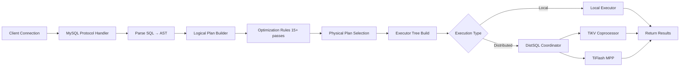

# TiDB Codebase Analysis - Quick Start Guide

**Analysis Date**: 2025-11-17
**Commit SHA**: `bd6aa865308ed409fd7010af83a84249bf398d8c`
**Repository**: https://github.com/pingcap/tidb
**Lines of Code (Go in `/pkg`)**: ~1,296,698
**Source Files**: 3,908 Go files

## Executive Summary

TiDB is a sophisticated, production-grade **distributed SQL database** implementing a MySQL-compatible interface over a distributed key-value storage layer (TiKV). The codebase demonstrates exceptional architectural discipline with clear separation of concerns across multiple layers.

### Key Findings at a Glance

**Architecture**: ✅ Excellent
- Clean layered architecture (Protocol → Session → Parser → Planner → Optimizer → Executor → Storage)
- Well-defined abstractions and interfaces
- Separation of compute (TiDB) and storage (TiKV)

**Code Quality**: ✅ Strong
- Extensive test coverage with 50+ shard parallelization
- Comprehensive observability (metrics, logging, tracing)
- Production-ready error handling and retry logic

**Performance**: ✅ Optimized
- Iterator-based execution with chunk batching
- Push-down computation to storage layer
- Advanced query optimization with cost-based planning

**Scalability**: ✅ Distributed-First
- Horizontal scalability via storage layer
- MPP support for analytical workloads
- Distributed transaction coordination

---

## What Makes TiDB Interesting?

### 1. **Hybrid Architecture (HTAP)**
TiDB uniquely supports both **OLTP** (row-based via TiKV) and **OLAP** (columnar via TiFlash) workloads in a single system. This eliminates the traditional need for separate transactional and analytical databases.

### 2. **Strong Consistency with Performance**
Despite being distributed, TiDB provides **ACID transactions** with serializability using:
- Percolator-based 2PC (Two-Phase Commit)
- Timestamp Oracle (TSO) via Placement Driver (PD)
- Both optimistic and pessimistic locking modes

### 3. **MySQL Compatibility**
Near-complete MySQL 8.0 protocol compatibility means minimal application changes for migration, while gaining distributed scalability.

### 4. **Advanced Query Optimization**
- 15+ optimization rule passes
- Dynamic programming for join reordering
- Statistics-based cost estimation
- Plan caching for prepared statements

---

## Architecture Highlights

```
Client Application (MySQL Protocol)
    ↓
┌─────────────────── TiDB SQL Layer ───────────────────┐
│  Protocol Server → Session → Parser → Planner        │
│  → Optimizer → Executor → DistSQL Coordinator        │
└──────────────────────────────────────────────────────┘
    ↓                              ↓
[TiKV - Row Storage]        [TiFlash - Columnar Storage]
    ↓
[PD - Placement Driver: Metadata & Timestamp Oracle]
```

### Core Components

| Component | Location | Lines | Responsibility |
|-----------|----------|-------|----------------|
| **Server** | `pkg/server/` | ~15K | MySQL protocol, connection management |
| **Session** | `pkg/session/` | ~25K | Execution context, transaction management |
| **Parser** | `pkg/parser/` | ~50K | SQL parsing, AST generation |
| **Planner** | `pkg/planner/` | ~120K | Logical/physical plan generation, optimization |
| **Executor** | `pkg/executor/` | ~180K | Query execution engine |
| **Storage** | `pkg/store/` | ~30K | Key-value storage abstraction |
| **Domain** | `pkg/domain/` | ~20K | Global metadata, lifecycle management |

---

## Testing Strategy

**Philosophy**: Comprehensive coverage with parallel execution

- **Unit Tests**: Co-located with source (`*_test.go`)
  - Shard count: Up to 50 parallel shards for large packages
  - Framework: `testify` for assertions, custom `TestKit` for SQL testing

- **Integration Tests**: `/tests/integrationtest/`
  - MySQL-style `.test` files with expected `.result` outputs
  - Supports both mock and real TiKV backends

- **Benchmarks**: Performance regression prevention
  - Located in `*_benchmark_test.go`
  - Covers critical paths (aggregation, sorting, type conversion)

**Quality Gates**:
- ✅ Goroutine leak detection (`goleak`)
- ✅ Failpoint injection for error paths
- ✅ Race detection in CI
- ✅ No parallel test execution (ensures determinism)

---

## Observability Infrastructure

### Metrics (Prometheus)
- **60+ metric families** covering:
  - Query latency (histogram with exponential buckets: 0.5ms to 1.5 days)
  - Connection counts, error rates
  - Memory usage and GC behavior
  - Plan cache hit rates

### Logging (Uber Zap)
- **Structured logging** with trace context propagation
- **Slow Query Log**: Dedicated file with 60+ fields
  - Query time, memory usage, rows scanned
  - Query plan digest, execution details
  - Rate limiting to prevent log flooding

### Tracing (OpenTracing + Jaeger)
- Distributed trace propagation across TiDB → TiKV
- Categories: Transaction lifecycle, 2PC, lock resolution, KV requests
- Flight recorder for post-mortem analysis

### Profiling
- **CPU**: Continuous profiling with pprof
- **Memory**: Heap and allocs profiling
- **Blocking**: Mutex and goroutine contention tracking

---

## Dependency Analysis

### Core Dependencies (Go 1.23.12)

| Dependency | Version | Purpose | Security Notes |
|------------|---------|---------|----------------|
| `tikv/client-go` | v2.0.8 | TiKV client library | ✅ Recent |
| `tikv/pd/client` | Latest | Placement Driver client | ✅ Active |
| `cockroachdb/pebble` | v1.1.4 | Embedded KV storage | ✅ Well-maintained |
| `prometheus/client_golang` | v1.22.0 | Metrics | ✅ Current |
| `uber/zap` | v1.27.0 | Structured logging | ✅ Stable |
| `grpc` | v1.63.2 | RPC framework | ⚠️ Downgraded intentionally |
| `etcd` | v3.5.15 | Coordination | ✅ Stable |

**Total Dependencies**: 154 direct + ~200 indirect

**Deprecated/Archived**:
- `sourcegraph/appdash` - Archived, but has explicit replacement in `go.mod`

**Version Strategy**: Pinned versions with controlled upgrades

---

## Configuration Management

**Format**: TOML-based configuration
**Location**: `pkg/config/config.go` (~2000 lines)

### Configuration Sections
```toml
[server]
host = "0.0.0.0"
port = 4000
token-limit = 1000  # Max concurrent queries

[log]
level = "info"
format = "text"  # or "json"
slow-query-file = "/var/log/tidb/slow.log"

[performance]
max-txn-ttl = 3600000  # 1 hour
stmt-count-limit = 5000

[prepared-plan-cache]
enabled = true
capacity = 100

[security]
ssl-ca = ""
ssl-cert = ""
ssl-key = ""

[opentracing]
enable = false
sampler.type = "const"
reporter.queue-size = 1024
```

**Dynamic Reconfiguration**: System variables can be changed at runtime via SQL (`SET GLOBAL ...`)

---

## Build System

**Primary**: Bazel (for hermetic, reproducible builds)
**Secondary**: Make (for developer workflows)

### Key Build Targets
```bash
make                      # Build TiDB server
make dev                  # Run full development workflow
make test                 # Run all tests (parallelized)
make check                # Static analysis, linting
bazel build //cmd/tidb-server:tidb-server
```

### CI/CD Integration
- **Prow-based CI**: `prow.tidb.net`
- **Build verification**: Post-submit builds
- **Test sharding**: Automatic via Bazel `shard_count`

---

## Data Flow: Query Execution Pipeline



**Typical Latency Breakdown** (for a point query):
- Parsing: <1ms
- Planning + Optimization: 1-5ms
- Plan cache lookup: <0.5ms (if cached)
- Execution: Variable (depends on data locality)
- Network (TiDB ↔ TiKV): 1-3ms (within datacenter)

---

## Failure Modes & Resilience

### Transaction Failures
| Failure | Detection | Recovery |
|---------|-----------|----------|
| **Write Conflict** | Commit-time validation | Client retry with exponential backoff |
| **Region Unavailable** | TiKV RPC timeout | Automatic region cache refresh + retry |
| **Lock Timeout** | TTL expiration | Transaction rollback |
| **PD Unavailable** | Connection timeout | Use cached timestamps (degraded mode) |

### System Failures
| Failure | Detection | Recovery |
|---------|-----------|----------|
| **TiDB Node Crash** | Client connection drop | Client reconnects to another TiDB node |
| **TiKV Node Crash** | Raft heartbeat failure | Automatic failover to replica |
| **Network Partition** | Lease expiration | DDL owner re-election |

**RTO** (Recovery Time Objective): Seconds (via Raft automatic failover)
**RPO** (Recovery Point Objective): Zero (no data loss with Raft majority)

---

## Key Insights for Contributors

### Strengths to Maintain
1. **Clean abstraction layers** - Easy to reason about and modify
2. **Comprehensive testing** - High confidence in changes
3. **Rich observability** - Production debugging is tractable
4. **Performance-first** - Chunk-based execution, push-down optimization

### Areas for Improvement (See RFCs)
1. **Plan cache warmup** - Cold start performance
2. **Memory management** - More aggressive spill-to-disk
3. **Optimizer statistics** - Auto-analyze overhead
4. **Error messages** - More user-friendly guidance

---

## Next Steps

1. **Read**: [Repository Structure](./repository-structure.md) - Detailed directory layout
2. **Understand**: [Dependency Graph](./dependency-graph.md) - Component relationships
3. **Explore**: [Blog Series](../blog-series/00-series-outline.md) - Deep dives into subsystems
4. **Contribute**: [RFCs](../rfcs/00-prioritization-matrix.md) - Proposed improvements

---

## Quick Reference: Important Files

| File | Description |
|------|-------------|
| `cmd/tidb-server/main.go` | Server entry point, initialization |
| `pkg/server/conn.go` | MySQL protocol handler |
| `pkg/session/session.go` | Session and transaction management |
| `pkg/planner/core/optimizer.go` | Query optimization logic |
| `pkg/executor/adapter.go` | Execution coordinator |
| `pkg/kv/kv.go` | Storage abstraction interfaces |
| `pkg/config/config.go` | Configuration definitions |

---

## Terminology Quick Reference

- **TiDB**: The SQL layer (this codebase)
- **TiKV**: Distributed row-based storage (separate repo)
- **TiFlash**: Distributed columnar storage (separate repo)
- **PD**: Placement Driver - metadata and timestamp oracle (separate repo)
- **Coprocessor**: Push-down computation on TiKV
- **MPP**: Massively Parallel Processing on TiFlash
- **TSO**: Timestamp Oracle in PD
- **InfoSchema**: In-memory metadata cache
- **Domain**: Global lifecycle manager for TiDB instance

---

**For More Details**: See full analysis documents in this directory and the blog series for comprehensive technical deep-dives.
