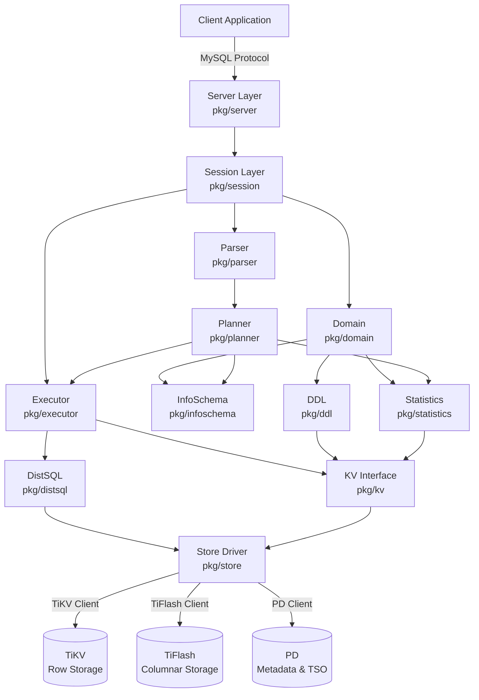
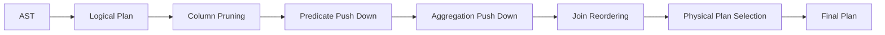

# TiDB Component Dependency Graph

**Analysis Commit**: `bd6aa865308ed409fd7010af83a84249bf398d8c`

## High-Level Architecture Diagram



---

## Layer-by-Layer Dependencies

### Layer 1: Entry Point
```
cmd/tidb-server/main.go
    ↓
├── pkg/config (configuration loading)
├── pkg/metrics (metrics initialization)
├── pkg/server (server creation)
└── pkg/domain (domain creation)
```

**Purpose**: Bootstrap the TiDB server instance

---

### Layer 2: Network & Protocol
```
pkg/server/
    ↓
├── pkg/session (session management)
├── pkg/parser (SQL parsing)
├── pkg/executor (query execution)
├── pkg/util/arena (memory management)
└── pkg/privilege (access control)
```

**Purpose**: Handle MySQL protocol and dispatch commands

**Key Dependencies**:
- **Incoming**: Client connections via TCP/Unix sockets
- **Outgoing**: Session creation for each connection

---

### Layer 3: Session Management
```
pkg/session/
    ↓
├── pkg/parser (parse SQL)
├── pkg/planner (build execution plan)
├── pkg/executor (execute statements)
├── pkg/domain (metadata access)
├── pkg/sessionctx (session context)
├── pkg/sessiontxn (transaction management)
└── pkg/kv (storage access)
```

**Purpose**: Execution context and transaction coordination

**Key Dependencies**:
- **Variable management**: `pkg/sessionctx/variable`
- **Transaction**: `pkg/sessiontxn` → `pkg/kv/Transaction`
- **Memory tracking**: `pkg/util/memory`

---

### Layer 4: SQL Parsing
```
pkg/parser/
    ↓
├── pkg/parser/ast (AST node definitions)
├── pkg/parser/model (schema models)
├── pkg/parser/types (type definitions)
└── pkg/parser/opcode (operators)
```

**Purpose**: Transform SQL text into Abstract Syntax Tree

**Key Dependencies**:
- **None** - Parser is self-contained (by design for reusability)
- Uses `goyacc` for grammar generation

---

### Layer 5: Query Planning
```
pkg/planner/
    ↓
├── pkg/parser/ast (AST input)
├── pkg/infoschema (table metadata)
├── pkg/statistics (table stats)
├── pkg/expression (expression evaluation)
├── pkg/util/ranger (range extraction)
├── pkg/planner/core/operator (logical/physical operators)
└── pkg/privilege (access checks)
```

**Purpose**: Transform AST into optimized execution plan

**Submodules**:
```
pkg/planner/core/
    ↓
├── logical_plan_builder.go (AST → Logical Plan)
├── optimizer.go (optimization rules)
├── exhaust_physical_plans.go (Logical → Physical)
├── task.go (cost model)
└── casetest/ (optimization test cases)
```

**Optimization Rule Dependencies**:


---

### Layer 6: Query Execution
```
pkg/executor/
    ↓
├── pkg/executor/internal/exec (executor interface)
├── pkg/expression (expression evaluation)
├── pkg/distsql (distributed execution)
├── pkg/kv (storage access)
├── pkg/util/chunk (data batching)
├── pkg/util/memory (memory tracking)
├── pkg/util/disk (spill-to-disk)
└── pkg/statistics (runtime stats)
```

**Purpose**: Execute physical plans and return results

**Executor Dependency Graph**:
```
ProjectionExec
    ↓
SelectionExec (filters)
    ↓
HashJoinExec
    ├── TableReaderExec (left table)
    │       ↓
    │   DistSQL → TiKV
    └── IndexReaderExec (right table)
            ↓
        DistSQL → TiKV
```

**Key Execution Dependencies**:
- `chunk.Chunk` - Columnar data batching
- `MemTracker` - Memory usage tracking
- `DiskTracker` - Temporary storage tracking
- `RuntimeStats` - Execution metrics

---

### Layer 7: Distributed SQL
```
pkg/distsql/
    ↓
├── pkg/kv (KV interface)
├── pkg/store/driver (TiKV client)
├── pkg/util/codec (encoding)
├── pkg/util/chunk (result batching)
└── github.com/tikv/client-go (TiKV RPC)
```

**Purpose**: Coordinate distributed query execution on TiKV/TiFlash

**Request Flow**:


**Coprocessor Push-Down**:
- Filters (`WHERE`)
- Aggregations (`GROUP BY`, `COUNT`, `SUM`)
- TopN (`ORDER BY ... LIMIT`)
- Projections (column selection)

---

### Layer 8: Storage Abstraction
```
pkg/kv/
    ↓
├── Interfaces: Storage, Transaction, Snapshot
├── pkg/store (driver implementations)
└── Error handling & retry logic
```

**Purpose**: Unified interface for multiple storage backends

**Interface Hierarchy**:
```
Storage (top-level)
    ├── Begin() → Transaction
    │       ├── Get/Set/Delete
    │       ├── Commit/Rollback
    │       └── LockKeys (pessimistic locking)
    └── GetSnapshot() → Snapshot
            ├── Get (point read)
            └── Iter (range scan)
```

---

### Layer 9: Storage Driver
```
pkg/store/
    ↓
├── pkg/store/driver (driver interface)
├── pkg/kv (KV interfaces)
└── github.com/tikv/client-go/v2 (TiKV client library)
```

**Drivers**:
1. **TiKV** (production): `pkg/store/driver/tikv_driver.go`
2. **UniStore** (embedded): `pkg/store/mockstore/unistore/`
3. **MockStore** (testing): `pkg/store/mockstore/`

**Client-Go Integration**:
```
pkg/store/driver
    ↓
github.com/tikv/client-go/v2
    ├── /tikv (TiKV client)
    ├── /txnkv (transactional KV)
    ├── /rawkv (raw KV)
    └── /config (client configuration)
```

---

### Cross-Cutting Concerns

#### Domain (Metadata Manager)
```
pkg/domain/
    ↓
├── pkg/infoschema (schema cache)
├── pkg/ddl (DDL executor)
├── pkg/statistics (stats handle)
├── pkg/privilege/privileges (privilege cache)
├── pkg/bindinfo (SQL binding cache)
├── pkg/ttl/ttlworker (TTL workers)
└── pkg/disttask (distributed tasks)
```

**Purpose**: Global state and lifecycle management

**Responsibilities**:
- InfoSchema reload (schema versioning)
- DDL owner election
- Statistics auto-analyze
- Background workers

#### InfoSchema (Metadata Cache)
```
pkg/infoschema/
    ↓
├── pkg/parser/model (schema models)
├── pkg/meta (metadata storage)
├── pkg/table (table interface)
└── pkg/kv (storage access)
```

**Purpose**: In-memory metadata cache

**Update Flow**:
```
DDL Operation
    ↓
Update Meta (in TiKV)
    ↓
Increment Schema Version
    ↓
Domain Reload InfoSchema
    ↓
All Queries Use New Schema
```

#### DDL (Schema Changes)
```
pkg/ddl/
    ↓
├── pkg/meta (metadata operations)
├── pkg/kv (storage access)
├── pkg/owner (owner election)
├── pkg/parser/model (schema models)
└── pkg/table (table operations)
```

**Purpose**: Online schema change execution

**Owner Election**:
```
pkg/ddl/owner/
    ↓
├── pkg/owner (generic owner election)
└── go.etcd.io/etcd/client/v3 (etcd coordination)
```

#### Statistics
```
pkg/statistics/
    ↓
├── pkg/kv (storage access)
├── pkg/sessionctx (context)
├── pkg/parser/model (schema models)
└── pkg/util/ranger (range calculation)
```

**Purpose**: Collect and maintain table statistics for optimization

**Statistics Components**:
- Histogram (value distribution)
- Count-Min Sketch (cardinality)
- TopN (frequent values)
- FMSketch (distinct value estimation)

---

## External Dependencies

### Direct External Dependencies

#### TiKV Client
```
github.com/tikv/client-go/v2 (v2.0.8)
    ├── Used by: pkg/store/driver
    ├── Purpose: TiKV cluster communication
    └── Features: Transaction, Region cache, Backoff

github.com/tikv/pd/client
    ├── Used by: pkg/store/driver
    ├── Purpose: PD (Placement Driver) client
    └── Features: TSO, Region routing, Cluster metadata
```

#### Storage Engine (Embedded)
```
github.com/cockroachdb/pebble (v1.1.4)
    ├── Used by: pkg/store/mockstore/unistore
    ├── Purpose: Embedded KV store for testing
    └── Features: LSM-tree, MVCC, Snapshots
```

#### Metrics & Observability
```
github.com/prometheus/client_golang (v1.22.0)
    ├── Used by: pkg/metrics
    ├── Purpose: Metrics exposition
    └── Features: Counter, Gauge, Histogram, Summary

github.com/uber/jaeger-client-go
    ├── Used by: pkg/util/tracing
    ├── Purpose: Distributed tracing
    └── Features: Span creation, Context propagation

github.com/pingcap/log (v1.1.1)
    ├── Used by: pkg/util/logutil
    ├── Purpose: Structured logging
    └── Based on: go.uber.org/zap
```

#### Coordination
```
go.etcd.io/etcd/client/v3 (v3.5.15)
    ├── Used by: pkg/ddl/owner, pkg/domain/infosync
    ├── Purpose: Distributed coordination
    └── Features: Key-value store, Watch, Lease
```

#### Utilities
```
github.com/pingcap/errors (v0.11.5)
    ├── Used by: All packages
    ├── Purpose: Error handling with stack traces
    └── Features: Wrap, Trace, Cause

github.com/pingcap/failpoint (v0.0.0-20240528)
    ├── Used by: Testing infrastructure
    ├── Purpose: Fault injection
    └── Features: Conditional code execution

github.com/stretchr/testify (v1.10.0)
    ├── Used by: All test files
    ├── Purpose: Testing utilities
    └── Features: require, assert, mock
```

---

## Dependency Analysis

### Critical Path Dependencies (Hot Path)

For a typical `SELECT` query:

```
Client SQL Query
    ↓
1. pkg/server (protocol decoding) - <1ms
    ↓
2. pkg/parser (SQL parsing) - ~1ms
    ↓
3. pkg/planner (optimization) - 2-10ms
    ↓ (Plan Cache Hit: <0.5ms)
4. pkg/executor (execution setup) - ~0.5ms
    ↓
5. pkg/distsql → tikv/client-go (data fetch) - 1-50ms
    ↓
6. Result serialization - ~1ms
```

**Total Typical Latency**: 5-70ms (dominated by network and storage)

### Dependency Stability Analysis

| Dependency | Stability | Update Frequency | Risk Level |
|------------|-----------|------------------|------------|
| tikv/client-go | ✅ Stable | Monthly | Low |
| tikv/pd | ✅ Stable | Monthly | Low |
| prometheus | ✅ Stable | Quarterly | Low |
| etcd | ✅ Stable | Quarterly | Low |
| zap | ✅ Stable | Rarely | Low |
| pebble | ⚠️ Active Dev | Frequently | Medium |
| grpc | ⚠️ Pinned | Intentionally downgraded | Low |

**Note on gRPC**: Intentionally downgraded to v1.63.2 (see `go.mod:363`) for compatibility reasons.

---

## Circular Dependency Prevention

TiDB uses **interface-based dependency injection** to prevent circular dependencies:

### Example: Domain ← → DDL

**Problem**: Domain needs DDL executor, DDL needs Domain for metadata

**Solution**:
```go
// pkg/ddl/ddl.go
type DDL interface {
    CreateTable(ctx sessionctx.Context, stmt *ast.CreateTableStmt) error
    // ...
}

// pkg/domain/domain.go
type Domain struct {
    ddl DDL  // Interface dependency
    // ...
}

// Initialization (cmd/tidb-server/main.go)
dom := domain.NewDomain(...)
ddl := ddl.NewDDL(dom, ...)
dom.SetDDL(ddl)  // Inject concrete implementation
```

---

## Build Dependency Graph (Bazel)

```
//cmd/tidb-server:tidb-server (main binary)
    ↓
├── //pkg/server:server
├── //pkg/domain:domain
├── //pkg/config:config
└── //pkg/metrics:metrics
    ↓
    ├── //pkg/session:session
    ├── //pkg/executor:executor
    └── //pkg/kv:kv
        ↓
        ├── //pkg/planner:planner
        ├── //pkg/parser:parser
        └── //pkg/store:store
            ↓
            └── @com_github_tikv_client_go_v2//:client-go
```

---

## Module Boundaries and Ownership

| Package | Owner Team | Changeability |
|---------|-----------|---------------|
| pkg/server | Server | High |
| pkg/session | Session | Medium |
| pkg/parser | SQL | Low (shared) |
| pkg/planner | SQL | Medium |
| pkg/executor | Execution | High |
| pkg/ddl | DDL | Medium |
| pkg/statistics | Statistics | High |
| pkg/store | Storage | Low (interface) |

**Low changeability**: Stable interfaces, breaking changes require RFC
**Medium changeability**: Frequent feature additions, compatible changes
**High changeability**: Active development, internal refactoring common

---

## Testing Dependency Isolation

### TestKit Pattern
```
Test Code
    ↓
pkg/testkit (test utilities)
    ↓
├── pkg/testkit/mockstore (mock storage)
│       ↓
│   pkg/store/mockstore/unistore (embedded KV)
└── pkg/session (real session)
```

**Benefit**: Tests can run without external TiKV cluster

### Failpoint Pattern
```
Production Code
    ↓
pkg/util/failpoint (conditional compilation)
    ↓
Test-only code paths
```

**Benefit**: Inject failures without modifying production paths

---

## Summary: Dependency Principles

1. **Layered Architecture**: Dependencies flow downward (Server → Session → Executor → Storage)
2. **Interface Abstraction**: `pkg/kv` abstracts storage, allowing multiple backends
3. **Minimal External Dependencies**: Core logic depends only on: tikv/client-go, prometheus, zap
4. **Testability**: Mock implementations for all external systems
5. **Stability**: Critical paths use stable, well-tested libraries

---

**Next**: See [Metrics Summary](./metrics-summary.md) for quantitative code analysis.
