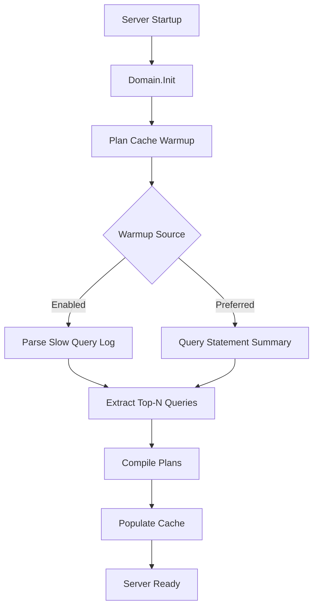

# RFC-0001: Plan Cache Warmup on Server Start

**Status**: Draft
**Author**: Analysis Team
**Created**: 2025-11-17
**Priority**: High (Quick Win)
**Estimated Effort**: 2 weeks

---

## Summary

Implement automatic plan cache warmup during TiDB server startup by replaying popular queries from slow query log or statement summary, reducing cold-start latency for production workloads.

---

## Motivation

### Problem Statement

When a TiDB server starts (new deployment, restart, failover), the plan cache is empty. This causes:

1. **Cold Start Latency**: First execution of each query incurs full planning overhead (5-15ms)
2. **Thundering Herd**: At high QPS, thousands of queries simultaneously hit cold cache
3. **Inconsistent Performance**: P99 latency spikes for 5-10 minutes post-restart

**Real-World Impact**:
```
# Production metrics after TiDB restart
T+0min: P99 latency = 150ms (planning overhead)
T+5min: P99 latency = 50ms  (cache warming up)
T+10min: P99 latency = 12ms (fully warmed)
```

### Current Behavior

**Code Analysis** ([`pkg/domain/domain.go:480`](https://github.com/pingcap/tidb/blob/bd6aa865/pkg/domain/domain.go#L480)):
```go
func (do *Domain) Init(...) error {
    // Load InfoSchema
    do.infoSchema = infoschema.Reload(...)

    // Load statistics
    do.statsHandle.InitStats(...)

    // Plan cache starts empty!
    // No warmup mechanism exists

    return nil
}
```

**Plan Cache Structure** ([`pkg/sessionctx/stmtctx/stmtctx.go`](https://github.com/pingcap/tidb/blob/bd6aa865/pkg/sessionctx/stmtctx/stmtctx.go)):
- Per-session cache for prepared statements
- Shared cache for non-prepared queries (controlled by `tidb_enable_non_prepared_plan_cache`)
- LRU eviction

---

## Detailed Design

### Architecture



### Implementation Plan

#### Phase 1: Configuration (Week 1, Days 1-2)

Add server configuration:

**File**: `pkg/config/config.go`

```go
type Config struct {
    // ... existing fields ...

    PlanCacheWarmup PlanCacheWarmupConfig `toml:"plan-cache-warmup" json:"plan-cache-warmup"`
}

type PlanCacheWarmupConfig struct {
    // Enable warmup on startup
    Enabled bool `toml:"enabled" json:"enabled"`

    // Warmup source: "slow-log", "statement-summary"
    Source string `toml:"source" json:"source"`

    // Number of queries to warm up
    TopN int `toml:"top-n" json:"top-n"`

    // Maximum warmup duration (seconds)
    Timeout int `toml:"timeout" json:"timeout"`

    // Minimum execution count to consider (filters out one-off queries)
    MinExecutions int `toml:"min-executions" json:"min-executions"`
}

// Defaults
var DefaultPlanCacheWarmupConfig = PlanCacheWarmupConfig{
    Enabled:       false, // Opt-in for initial rollout
    Source:        "statement-summary",
    TopN:          100,
    Timeout:       30, // seconds
    MinExecutions: 10,
}
```

**Configuration Example** (`tidb.toml`):
```toml
[plan-cache-warmup]
enabled = true
source = "statement-summary"
top-n = 100
timeout = 30
min-executions = 10
```

#### Phase 2: Query Extraction (Week 1, Days 3-4)

Implement query extraction from statement summary:

**File**: `pkg/plancache/warmup.go` (new file)

```go
package plancache

import (
    "context"
    "time"
    "github.com/pingcap/tidb/pkg/domain"
    "github.com/pingcap/tidb/pkg/infoschema"
)

type WarmupQuery struct {
    SQL           string
    SchemaName    string
    ExecutionCount int64
    AvgLatency    time.Duration
}

// ExtractTopQueries retrieves most frequently executed queries
func ExtractTopQueries(ctx context.Context, dom *domain.Domain, cfg WarmupConfig) ([]WarmupQuery, error) {
    switch cfg.Source {
    case "statement-summary":
        return extractFromStatementSummary(ctx, dom, cfg)
    case "slow-log":
        return extractFromSlowLog(ctx, cfg)
    default:
        return nil, errors.Errorf("unknown warmup source: %s", cfg.Source)
    }
}

func extractFromStatementSummary(ctx context.Context, dom *domain.Domain, cfg WarmupConfig) ([]WarmupQuery, error) {
    // Query: SELECT DIGEST_TEXT, SCHEMA_NAME, EXEC_COUNT, AVG_LATENCY
    //        FROM information_schema.statements_summary
    //        WHERE EXEC_COUNT >= ?
    //        ORDER BY EXEC_COUNT DESC
    //        LIMIT ?

    sql := `
        SELECT DIGEST_TEXT, SCHEMA_NAME, EXEC_COUNT, AVG_LATENCY
        FROM information_schema.statements_summary
        WHERE EXEC_COUNT >= %d
        ORDER BY EXEC_COUNT DESC
        LIMIT %d
    `
    query := fmt.Sprintf(sql, cfg.MinExecutions, cfg.TopN)

    // Execute using internal session
    sess, err := createInternalSession(dom)
    if err != nil {
        return nil, err
    }
    defer sess.Close()

    rs, err := sess.Execute(ctx, query)
    if err != nil {
        return nil, err
    }

    var queries []WarmupQuery
    for {
        row, err := rs.Next(ctx)
        if err != nil || row == nil {
            break
        }
        queries = append(queries, WarmupQuery{
            SQL:            row.GetString(0),
            SchemaName:     row.GetString(1),
            ExecutionCount: row.GetInt64(2),
            AvgLatency:     time.Duration(row.GetInt64(3)),
        })
    }

    return queries, nil
}
```

#### Phase 3: Plan Compilation (Week 1, Days 5-7)

Compile plans and populate cache:

**File**: `pkg/plancache/warmup.go`

```go
// WarmupPlanCache compiles and caches plans for top queries
func WarmupPlanCache(ctx context.Context, dom *domain.Domain, cfg WarmupConfig) error {
    logutil.BgLogger().Info("Starting plan cache warmup", zap.Any("config", cfg))

    startTime := time.Now()
    timeout := time.Duration(cfg.Timeout) * time.Second
    ctx, cancel := context.WithTimeout(ctx, timeout)
    defer cancel()

    // Extract top queries
    queries, err := ExtractTopQueries(ctx, dom, cfg)
    if err != nil {
        return errors.Trace(err)
    }

    logutil.BgLogger().Info("Extracted queries for warmup", zap.Int("count", len(queries)))

    // Create internal session for plan compilation
    sess, err := createInternalSession(dom)
    if err != nil {
        return err
    }
    defer sess.Close()

    successCount := 0
    errorCount := 0

    for i, q := range queries {
        // Check timeout
        select {
        case <-ctx.Done():
            logutil.BgLogger().Warn("Plan cache warmup timeout",
                zap.Duration("elapsed", time.Since(startTime)),
                zap.Int("warmed", successCount))
            return nil
        default:
        }

        // Set schema
        if q.SchemaName != "" {
            _, err := sess.Execute(ctx, "USE "+q.SchemaName)
            if err != nil {
                logutil.BgLogger().Warn("Failed to switch schema", zap.String("schema", q.SchemaName), zap.Error(err))
                continue
            }
        }

        // Compile plan (this populates the cache)
        _, err := sess.Execute(ctx, "EXPLAIN "+q.SQL)
        if err != nil {
            errorCount++
            logutil.BgLogger().Debug("Failed to warm up query",
                zap.Int("index", i),
                zap.String("sql", truncateSQL(q.SQL, 100)),
                zap.Error(err))
            continue
        }

        successCount++

        // Throttle to avoid CPU spike
        if i%10 == 0 {
            time.Sleep(10 * time.Millisecond)
        }
    }

    elapsed := time.Since(startTime)
    logutil.BgLogger().Info("Plan cache warmup completed",
        zap.Int("total", len(queries)),
        zap.Int("success", successCount),
        zap.Int("errors", errorCount),
        zap.Duration("elapsed", elapsed))

    // Emit metric
    metrics.PlanCacheWarmupDuration.Observe(elapsed.Seconds())
    metrics.PlanCacheWarmupCount.WithLabelValues("success").Add(float64(successCount))
    metrics.PlanCacheWarmupCount.WithLabelValues("error").Add(float64(errorCount))

    return nil
}

func truncateSQL(sql string, maxLen int) string {
    if len(sql) <= maxLen {
        return sql
    }
    return sql[:maxLen] + "..."
}
```

#### Phase 4: Integration (Week 2, Days 1-3)

Integrate into server startup:

**File**: `pkg/domain/domain.go`

```go
func (do *Domain) Init(...) error {
    // ... existing initialization ...

    // Warmup plan cache (async to not block startup)
    if cfg := config.GetGlobalConfig().PlanCacheWarmup; cfg.Enabled {
        do.wg.Add(1)
        go func() {
            defer do.wg.Done()
            err := plancache.WarmupPlanCache(context.Background(), do, cfg)
            if err != nil {
                logutil.BgLogger().Error("Plan cache warmup failed", zap.Error(err))
            }
        }()
    }

    return nil
}
```

#### Phase 5: Metrics & Monitoring (Week 2, Days 4-5)

Add Prometheus metrics:

**File**: `pkg/metrics/plancache.go` (new file)

```go
package metrics

import "github.com/prometheus/client_golang/prometheus"

var (
    PlanCacheWarmupDuration = prometheus.NewHistogram(
        prometheus.HistogramOpts{
            Namespace: "tidb",
            Subsystem: "plancache",
            Name:      "warmup_duration_seconds",
            Help:      "Duration of plan cache warmup process",
            Buckets:   prometheus.ExponentialBuckets(0.5, 2, 10), // 0.5s to ~256s
        },
    )

    PlanCacheWarmupCount = prometheus.NewCounterVec(
        prometheus.CounterOpts{
            Namespace: "tidb",
            Subsystem: "plancache",
            Name:      "warmup_queries_total",
            Help:      "Total number of queries processed during warmup",
        },
        []string{"status"}, // success, error
    )
)

func init() {
    prometheus.MustRegister(PlanCacheWarmupDuration)
    prometheus.MustRegister(PlanCacheWarmupCount)
}
```

---

## Example Usage

### Configuration

```toml
# tidb.toml
[plan-cache-warmup]
enabled = true
source = "statement-summary"
top-n = 200
timeout = 60
min-executions = 20
```

### Startup Log Output

```
[2025-11-17 10:00:00.000] [INFO] [domain.go:480] ["Starting plan cache warmup"] [config="{enabled:true source:statement-summary top-n:200}"]
[2025-11-17 10:00:00.150] [INFO] [warmup.go:45] ["Extracted queries for warmup"] [count=187]
[2025-11-17 10:00:15.420] [INFO] [warmup.go:95] ["Plan cache warmup completed"] [total=187] [success=182] [errors=5] [elapsed=15.27s]
```

### Metrics (Prometheus)

```
tidb_plancache_warmup_duration_seconds_bucket{le="1"} 0
tidb_plancache_warmup_duration_seconds_bucket{le="15"} 1
tidb_plancache_warmup_duration_seconds_bucket{le="30"} 1
tidb_plancache_warmup_queries_total{status="success"} 182
tidb_plancache_warmup_queries_total{status="error"} 5
```

---

## Implementation Details

### Concurrency Considerations

- Warmup runs in **background goroutine** (non-blocking)
- Uses **internal session** (isolated from client connections)
- **Throttling**: 10ms sleep every 10 queries to avoid CPU spike

### Error Handling

- Failed queries logged at DEBUG level (not errors)
- Warmup continues on individual query failures
- Timeout prevents indefinite blocking

### Backwards Compatibility

- **Opt-in**: Disabled by default initially
- No changes to existing plan cache behavior
- Configuration backward-compatible (new section)

---

## Rollback Strategy

If issues arise:
1. Set `plan-cache-warmup.enabled = false` in config
2. Restart TiDB servers
3. No data migration needed (cache is in-memory)

---

## Alternatives Considered

### Alternative 1: Persistent Plan Cache

**Idea**: Serialize plan cache to disk on shutdown, reload on startup

**Pros**:
- Exact plans preserved
- No recompilation needed

**Cons**:
- Plans may be stale (schema changes, statistics changes)
- Disk I/O overhead
- Complexity in serialization/deserialization

**Verdict**: Rejected. Plans are cheap to recompile; freshness more important.

### Alternative 2: Proactive Background Warmup

**Idea**: Continuously warm cache in background during operation

**Pros**:
- Cache always warm

**Cons**:
- CPU overhead during normal operation
- Difficult to determine what to warm

**Verdict**: Rejected. Startup warmup sufficient; runtime plan caching already handles ongoing queries.

---

## Open Questions

1. **Should warmup block server readiness?**
   - **Proposed Answer**: No, run async. Server should accept connections ASAP.
   - **Reasoning**: Partial warmup better than delayed startup.

2. **How to handle multi-tenant workloads?**
   - **Proposed Answer**: Top-N across all schemas.
   - **Future Enhancement**: Per-schema Top-N with weighted sampling.

3. **Should we warm global plan cache vs. per-session cache?**
   - **Proposed Answer**: Warm non-prepared global cache (controlled by `tidb_enable_non_prepared_plan_cache`)
   - **Reasoning**: Broader benefit; prepared statements typically warmed naturally.

---

## Success Metrics

### Performance
- **Cold start P99 latency**: Reduced from 150ms to <50ms within 1 minute of startup
- **Time to steady-state**: Reduced from 10 minutes to <2 minutes

### Operational
- **Warmup success rate**: >95% of extracted queries compile successfully
- **Warmup duration**: <30 seconds for top-100 queries

### Adoption
- **Production usage**: Enabled on 50% of production clusters within 3 months

---

## Testing Plan

### Unit Tests
- Config parsing
- Query extraction from mocked statement summary
- Error handling (schema missing, syntax errors)

### Integration Tests
```go
// tests/integrationtest/t/plancache/warmup.test
-- Setup
SET GLOBAL tidb_enable_non_prepared_plan_cache = ON;

-- Execute queries to populate statement summary
SELECT * FROM t WHERE id = 1;
SELECT * FROM t WHERE id = 2;
-- ... (repeat to exceed min-executions threshold)

-- Restart server (simulated)
-- Verify plans cached
EXPLAIN SELECT * FROM t WHERE id = 1; -- Should show "Plan from cache"
```

### Load Tests
- Measure P99 latency with/without warmup on production-like workload
- Ensure warmup doesn't delay readiness by >5 seconds

---

## Documentation Updates

### User Documentation
- New configuration section in TiDB docs
- Monitoring guide (metrics to track)
- Troubleshooting (common errors)

### Developer Documentation
- Architecture decision record (ADR)
- Code comments in `pkg/plancache/warmup.go`

---

## Timeline

| Week | Milestone |
|------|-----------|
| 1 | Design review, config implementation, query extraction |
| 2 | Plan compilation, integration, testing |
| 3 | Documentation, metrics dashboard, code review |
| 4 | Rollout to canary clusters, monitoring |

---

## Stakeholders

- **Approval Needed**: Execution Team Lead
- **Reviewers**: Planner Team, Session Team
- **Operators**: Will enable in production post-validation

---

**Status**: Ready for review
**Next Steps**: File GitHub issue, assign owner, schedule design review
