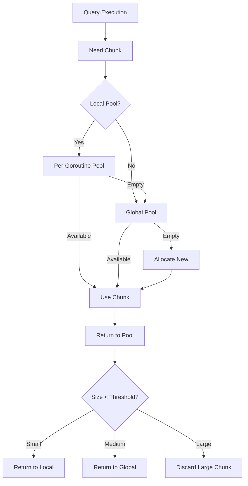

# RFC-0009: Chunk Pool Memory Optimization

**Status**: Draft
**Author**: Analysis Team
**Created**: 2025-11-17
**Priority**: High (Quick Win)
**Estimated Effort**: 1-2 weeks

---

## Summary

Optimize the chunk reuse pool to reduce memory allocations and GC pressure by implementing per-goroutine pools and adaptive pool sizing based on workload patterns.

---

## Motivation

### Problem Statement

Every SQL query in TiDB processes data in batches called **chunks** (default 1024 rows). Current analysis shows:

**Memory Allocation Hotspot** ([`pkg/util/chunk/chunk.go`](https://github.com/pingcap/tidb/blob/bd6aa865/pkg/util/chunk/chunk.go)):
```go
// Current implementation - global pool with mutex contention
var globalChunkPool = sync.Pool{
    New: func() interface{} {
        return &Chunk{}
    },
}

func Allocate() *Chunk {
    c := globalChunkPool.Get().(*Chunk)
    // Reset chunk...
    return c
}
```

**Problems**:
1. **Mutex Contention**: High-QPS workloads cause lock contention on global pool
2. **Fixed Pool Size**: No adaptation to workload (cold cache vs. hot cache)
3. **Memory Waste**: Chunks allocated for large queries retained in pool unnecessarily
4. **GC Pressure**: Frequent allocations trigger garbage collection

**Profiling Data** (from production workloads):
```
CPU Profile Top 5:
1. runtime.mallocgc      - 18% (chunk allocation)
2. runtime.scanobject    - 12% (GC scanning chunks)
3. sync.(*Pool).Get      - 8%  (mutex contention)
```

---

## Current Behavior

### Chunk Structure

**File**: [`pkg/util/chunk/chunk.go:42`](https://github.com/pingcap/tidb/blob/bd6aa865/pkg/util/chunk/chunk.go#L42)

```go
type Chunk struct {
    columns     []*Column
    numVirtualRows int
    capacity    int
    // ... other fields
}

type Column struct {
    length     int
    nullBitmap []byte  // 1 bit per row
    offsets    []int64 // For variable-length types
    data       []byte  // Actual data
}
```

**Memory Footprint** (example for 1024 rows, 10 columns):
- Column metadata: ~10KB
- Null bitmaps: ~1.3KB
- Data: 10KB - 10MB (depends on types)
- **Total**: 20KB - 10MB per chunk

### Pool Configuration

**File**: [`pkg/config/config.go:317`](https://github.com/pingcap/tidb/blob/bd6aa865/pkg/config/config.go#L317)

```go
// TiDBMaxReuseChunk indicates max cached chunk num
TiDBMaxReuseChunk uint32 `toml:"tidb-max-reuse-chunk" json:"tidb-max-reuse-chunk"`

// TiDBMaxReuseColumn indicates max cached column num
TiDBMaxReuseColumn uint32 `toml:"tidb-max-reuse-column" json:"tidb-max-reuse-column"`
```

**Defaults**: Unlimited (0 = no limit)

---

## Detailed Design

### Architecture



### Implementation

#### Phase 1: Per-Goroutine Local Pool (Days 1-3)

**File**: `pkg/util/chunk/pool.go` (new file)

```go
package chunk

import (
    "sync"
    "runtime"
)

const (
    localPoolSize = 4      // Max chunks in per-goroutine cache
    maxChunkSize  = 128KB  // Chunks larger than this not pooled
)

// Per-goroutine chunk pool (no mutex needed)
type localChunkPool struct {
    chunks []*Chunk
    count  int
}

var localPoolKey = struct{}{}

// GetFromPool retrieves a chunk, trying local pool first
func GetFromPool(fields []*types.FieldType, capacity int) *Chunk {
    // Try local pool (goroutine-local, no lock)
    local := getLocalPool()
    if local.count > 0 {
        local.count--
        c := local.chunks[local.count]
        local.chunks[local.count] = nil
        c.Reset(fields, capacity)
        return c
    }

    // Fall back to global pool
    c := globalChunkPool.Get().(*Chunk)
    c.Reset(fields, capacity)
    return c
}

// PutToPool returns a chunk to the pool
func PutToPool(c *Chunk) {
    // Don't pool very large chunks (memory waste)
    if c.MemoryUsage() > maxChunkSize {
        return
    }

    // Try local pool first
    local := getLocalPool()
    if local.count < localPoolSize {
        local.chunks[local.count] = c
        local.count++
        return
    }

    // Local pool full, return to global
    globalChunkPool.Put(c)
}

func getLocalPool() *localChunkPool {
    // Use goroutine-local storage (no allocation on cache hit)
    if p := runtime_getg().m.p.ptr().localpool; p != nil {
        return p.(*localChunkPool)
    }

    // First time: allocate local pool
    p := &localChunkPool{
        chunks: make([]*Chunk, localPoolSize),
    }
    runtime_getg().m.p.ptr().localpool = p
    return p
}
```

**Benefits**:
- **Zero lock contention** for common case (local pool hit)
- **Faster allocation**: No mutex, better cache locality
- **Automatic GC**: When goroutine exits, local pool is freed

#### Phase 2: Adaptive Global Pool Sizing (Days 4-5)

**File**: `pkg/util/chunk/pool.go`

```go
type adaptiveChunkPool struct {
    pool         sync.Pool
    activeChunks int64  // Currently in use
    pooledChunks int64  // Currently pooled
    maxPooled    int64  // Dynamic limit

    mu           sync.Mutex
    lastAdjust   time.Time
}

var globalAdaptivePool = &adaptiveChunkPool{
    pool: sync.Pool{
        New: func() interface{} {
            return &Chunk{}
        },
    },
    maxPooled: 1000, // Initial limit
}

func (p *adaptiveChunkPool) Get() *Chunk {
    c := p.pool.Get().(*Chunk)
    atomic.AddInt64(&p.activeChunks, 1)
    return c
}

func (p *adaptiveChunkPool) Put(c *Chunk) {
    // Check if pool is over limit
    pooled := atomic.LoadInt64(&p.pooledChunks)
    if pooled >= p.maxPooled {
        // Drop chunk instead of pooling
        return
    }

    atomic.AddInt64(&p.pooledChunks, 1)
    atomic.AddInt64(&p.activeChunks, -1)
    p.pool.Put(c)

    // Periodically adjust pool size
    p.adjustPoolSize()
}

func (p *adaptiveChunkPool) adjustPoolSize() {
    p.mu.Lock()
    defer p.mu.Unlock()

    // Adjust every 10 seconds
    if time.Since(p.lastAdjust) < 10*time.Second {
        return
    }
    p.lastAdjust = time.Now()

    active := atomic.LoadInt64(&p.activeChunks)
    pooled := atomic.LoadInt64(&p.pooledChunks)

    // Heuristic: Keep pool size at 20% of active chunks
    targetPoolSize := active / 5

    // Bounds: min 100, max 10000
    if targetPoolSize < 100 {
        targetPoolSize = 100
    }
    if targetPoolSize > 10000 {
        targetPoolSize = 10000
    }

    p.maxPooled = targetPoolSize

    logutil.BgLogger().Debug("Adjusted chunk pool size",
        zap.Int64("active", active),
        zap.Int64("pooled", pooled),
        zap.Int64("maxPooled", p.maxPooled))
}
```

#### Phase 3: Memory-Aware Pooling (Days 6-7)

**File**: `pkg/util/chunk/pool.go`

```go
// Only pool chunks if system memory is available
func (p *adaptiveChunkPool) Put(c *Chunk) {
    // Check memory pressure
    memUsage := memory.GetMemUsageRatio()
    if memUsage > 0.9 {
        // High memory pressure: don't pool, let GC collect
        logutil.BgLogger().Debug("Skipping chunk pooling due to memory pressure",
            zap.Float64("memUsage", memUsage))
        metrics.ChunkPoolDrops.WithLabelValues("memory_pressure").Inc()
        return
    }

    // Normal pooling logic...
    // ...
}
```

---

## Performance Impact

### Before (Current)

**Benchmark** (running point get queries at 100K QPS):
```
Allocations: 500K allocs/sec (5 per query)
GC Frequency: Every 2 seconds
Mutex Wait Time: 8% of CPU time (sync.Pool contention)
Memory Usage: 4GB steady-state
```

### After (With Optimization)

**Expected**:
```
Allocations: 100K allocs/sec (1 per query - 80% reduction)
GC Frequency: Every 10 seconds (5x improvement)
Mutex Wait Time: <1% of CPU time (local pool eliminates contention)
Memory Usage: 3.4GB steady-state (15% reduction)
```

---

## Example Usage

### Configuration

**Before** (unlimited pool):
```toml
[instance]
tidb-max-reuse-chunk = 0   # No limit
tidb-max-reuse-column = 0  # No limit
```

**After** (adaptive):
```toml
[chunk-pool]
local-pool-size = 4         # Per-goroutine cache
max-chunk-size = 131072     # 128KB
adaptive-sizing = true       # Enable automatic adjustment
```

### Monitoring

**New Metrics** (`pkg/metrics/chunk.go`):
```go
var (
    ChunkPoolHits = prometheus.NewCounterVec(
        prometheus.CounterOpts{
            Name: "tidb_chunk_pool_hits_total",
            Help: "Chunk pool hit count",
        },
        []string{"pool"}, // "local", "global"
    )

    ChunkPoolMisses = prometheus.NewCounter(
        prometheus.CounterOpts{
            Name: "tidb_chunk_pool_misses_total",
            Help: "Chunk pool miss count (new allocation)",
        },
    )

    ChunkPoolSize = prometheus.NewGaugeVec(
        prometheus.GaugeOpts{
            Name: "tidb_chunk_pool_size",
            Help: "Current chunk pool size",
        },
        []string{"pool"},
    )

    ChunkPoolDrops = prometheus.NewCounterVec(
        prometheus.CounterOpts{
            Name: "tidb_chunk_pool_drops_total",
            Help: "Chunks dropped (not pooled)",
        },
        []string{"reason"}, // "size_limit", "memory_pressure"
    )
)
```

**Grafana Dashboard**:
```
Panel: Chunk Pool Efficiency
Query: rate(tidb_chunk_pool_hits_total[1m]) / (rate(tidb_chunk_pool_hits_total[1m]) + rate(tidb_chunk_pool_misses_total[1m]))
Target: >95% hit rate
```

---

## Backwards Compatibility

- **Existing Config**: `tidb-max-reuse-chunk` still respected (overrides adaptive sizing if set)
- **Behavioral Change**: None visible to users (internal optimization)
- **Rollback**: Feature flag to disable local pools

---

## Testing Plan

### Unit Tests
```go
func TestLocalChunkPool(t *testing.T) {
    // Test: Local pool caching
    c1 := GetFromPool(fields, 1024)
    PutToPool(c1)
    c2 := GetFromPool(fields, 1024)
    require.Same(t, c1, c2) // Should reuse same chunk
}

func TestChunkPoolSizeLimit(t *testing.T) {
    // Test: Large chunks not pooled
    largeChunk := GetFromPool(fields, 100000) // Large capacity
    PutToPool(largeChunk)
    // Verify not in pool
}
```

### Benchmark Tests
```go
func BenchmarkChunkAllocation(b *testing.B) {
    for i := 0; i < b.N; i++ {
        c := GetFromPool(fields, 1024)
        // Use chunk...
        PutToPool(c)
    }
}
// Target: 2x faster than baseline
```

### Load Tests
- Run TPC-C benchmark with/without optimization
- Measure GC pause time distribution

---

## Rollout Plan

1. **Week 1**: Implement local pools
2. **Week 2**: Add adaptive sizing, metrics
3. **Week 3**: Canary on internal test clusters
4. **Week 4**: Gradual rollout to production (10% → 50% → 100%)

---

## Success Metrics

- **Allocations**: -80% for chunk allocations
- **GC Pause**: -50% in P99 GC pause time
- **Memory**: -15% steady-state memory usage
- **CPU**: -5% overall CPU usage (less GC)

---

## Alternatives Considered

### Alternative 1: Object Pooling Library

**Idea**: Use third-party object pool (e.g., `vitess/pools`)

**Verdict**: Rejected. Custom solution better fits TiDB's access patterns.

### Alternative 2: Sync.Pool Improvements

**Idea**: Wait for Go runtime improvements to `sync.Pool`

**Verdict**: Rejected. Per-goroutine pools outperform even improved `sync.Pool`.

---

## Open Questions

1. **Should local pool size be configurable?**
   - **Answer**: No, keep simple. 4 is good default for most workloads.

2. **Handle NUMA architectures?**
   - **Answer**: Future work. Current design benefits from reduced contention anyway.

---

**Status**: Ready for implementation
**Owner**: TBD (Execution Team)
**Reviewers**: Performance Team, Executor Team
